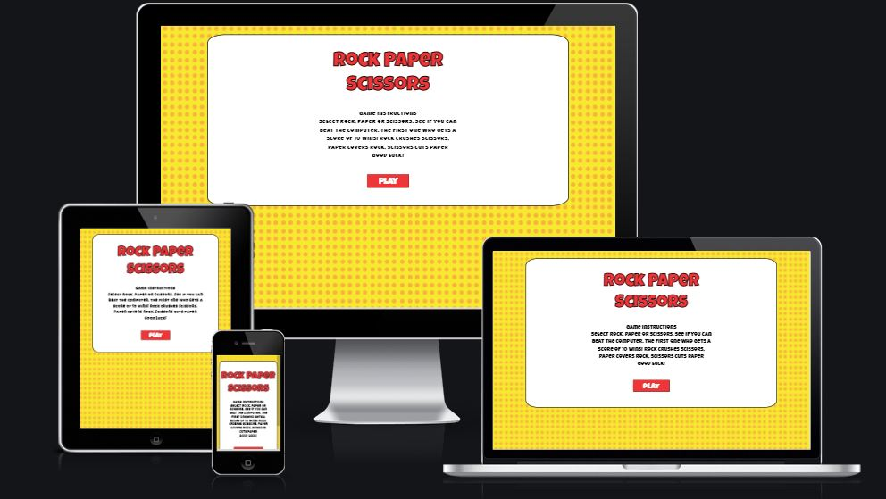
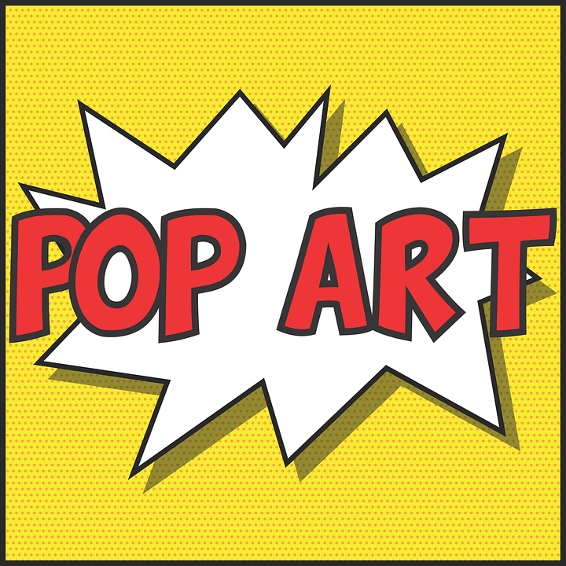

<h1 align="center">Rock Paper Scissors</h1>

Rock Paper Scissors is a fun, simple and interactive computer game. The player selects Rock, Paper or Scissors and the computer does the same. Whoever gets to a score of ten first wins the game.

Rock crushes scissors, paper covers rock, scissors cuts paper.

<h2>Features</h2>

<b>Index Page:</b>

- Main Title Letting users know the name of the game.
- Instructions paragraph explains the aim of the game in simple terms
- Play button to get the game started

<b> Play page </b>

- Main Title at the top of page
- Result in the middle of the game container to let the user know if they won,drew or lost the round
- Player Side to the left shows the player the option they have chosen Rock, Paper or Scissors
- The players options are on the bottom right hand side (Rock, Paper, Scissors)
- Computer Side to the right shows the player the option the computer has chosen
- The Player and Computers Score is shown on the bottom right hand side. 

<b>Game Finished Page</b>

- Main Title at the top of page
- Play Again Button directs user back to the play page
- Exit Game Button brings user back to the intro page

<h2>Features left to Implement</h2>
- I would like to implement audio and some animation to the graphics.
- I would also like to implement different levels of difficulty
- I woild like to get rid of the alert when the player has won or lost the game and replace it with an animated div.

<h2>Design</h2>
- I choose bright fun colours for my game.
- I got inspiration from a pop art image I found on Pixabay. See image below

- The colour pallet for the game is shown in the image below.
- These colours are taken from the pop art image

- I choose a fun font for my game from Google Fonts Luckiest guy https://fonts.google.com/specimen/Luckiest+Guy#standard-styles

- I created my own images using Adobe Illustrator
<h2> Wireframes </h2>
- To plan the layout of my game I used wireframes. I created this wireframe in Adobe Illustrator

<h2>Testing</h2>
- I tested this game in different browsers such as Google Chrome, Internet Explorer and Mozilla Firefox
- I got 2 users to play the game and give feedback
- I played the game several times to insure game is working
- I tested this game on Lighthouse in Dev Tools see image below

<h2> Validator Testing </h2>
- I ran all of my HTML code through W3C validator and fixed any errors
- I ran all of my CSS code through W3C CSS validator and no errors were returned
- I ran all of my JavaScript code through Jshint and confirmed there was no warnings apart from the ones on image below.

<h2> Bugs </h2>
<b>Unsolved Bugs</b>

<h2> Credits </h3>
- I used code from a video on Youtube. See link below

https://www.youtube.com/watch?v=qWPtKtYEsN4&t=2464s

- I also used code from a Github Rock Paaper Scissors Game. See link below

https://github.com/wakey001/Endless-Rock-Paper-Scissors/blob/main/assets/js/app.js

<h2> Deployment </h2>

I recieved a live link to the game after deployingg yhe game to Github pages This is how I deployed my project

1. Log into git Hub
2. Locate the specific repository
3. Select the settings link
4. In the settings scroll down to pages
5. Under the source heading select the dropdown menu and select main.
6. A link to your website will be provided
7. live link: https://deecooper.github.io/Rock-Paper-Scissors-Game/play.html

https://www.youtube.com/watch?v=qWPtKtYEsN4&t=2464s

https://github.com/wakey001/Endless-Rock-Paper-Scissors/blob/main/assets/js/app.js